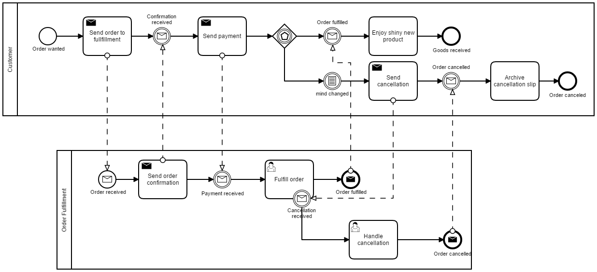

# Communication between two independent process engines

This examples shows how a customer process, which order goods, communicates with an order process that fulfills incoming orders.

Here is the collaboration:



Each process runs in it's own spring-boot application build with the [camunda-spring-boot-starter](https://docs.camunda.org/manual/7.8/user-guide/spring-boot-integration/).

Both engines communicate via REST Api to send messages. In this special case, there is no message conversion needed, as both know their partner. See [the rest api](https://docs.camunda.org/manual/7.8/reference/rest/message/post-message/) for details how to send a message. The correlation is done with the business key here.

This rest call can be easly implemented in a spring-boot application. The http client implementation comes with the dependency to spring-web and is easy to code in a [deletegate class](customer/src/main/java/com/camunda/consulting/customer/SendMessageRest.java#L39-L56). The overhead to get the IP address of the partner is done to run the example in a docker environment as well ([see below](#run-the-example-on-docker)).

To get some traffic on the orders, the customer uses an [order simulator](customer/src/main/java/com/camunda/consulting/customer/OrderSimulator.java), which is a [scheduled bean](https://spring.io/guides/gs/scheduling-tasks/), to send a new order every five seconds.

The order fulfiller has a [user simulator](orderFulfiller/src/main/java/com/camunda/consulting/orderFulfiller/UserSimulator.java), a scheduled bean as well, to complete every second task and wait a random time up to five seconds afterwards.

## How to run the example

Open two terminal windows, change to the directories of `customer` and `orderFulfiller` and enter
```
mvn clean spring-boot:run
```
in each terminal.

Or build and run the applications with 
```
mvn clean package
java -jar target\orderFulfiller.jar
```
and
```
mvn clean package
java -jar target\customer.jar
```

Inspect the console output for starting and fulfilling orders.

The tomcat servers run on ports

- 8081 for the orderFulfiller
- 8082 for the customer

To inspect the cockpits, open [http://localhost:8081/app/cockpit/default/#/dashboard](http://localhost:8081/app/cockpit/default/#/dashboard) and [http://localhost:8082/app/cockpit/default/#/dashboard](http://localhost:8082/app/cockpit/default/#/dashboard) in two separate browsers (They may not share their cookies). Login with user `demo`, password `demo`

As the REST Api is deployed, you can reach the engines via rest client. For example, the urls [http://localhost:8081/rest/history/process-instance/count?finished=true](http://localhost:8081/rest/history/process-instance/count?finished=true) and [http://localhost:8082/rest/history/process-instance/count?finished=true](http://localhost:8082/rest/history/process-instance/count?finished=true) to get the number of completed process instances from each engine.

## Run the example on Docker

Go to the directory of the message example and build the software for each server with
```
mvn clean package
```

Afterwards start the docker composition with

```
docker-compose up --build -d
```

Inspect the logs of each container with either

```
docker-compose logs customer
```

and

```
docker-compose logs fulfiller
```

The [docker-compose.yml file](docker-compose.yml) defines the names `customer`and `fulfiller` and puts both containers into a virtual network, where both server can see each other.

So, the delegate classes can get the IP address of the other participant when they ask for the hostname of these.
